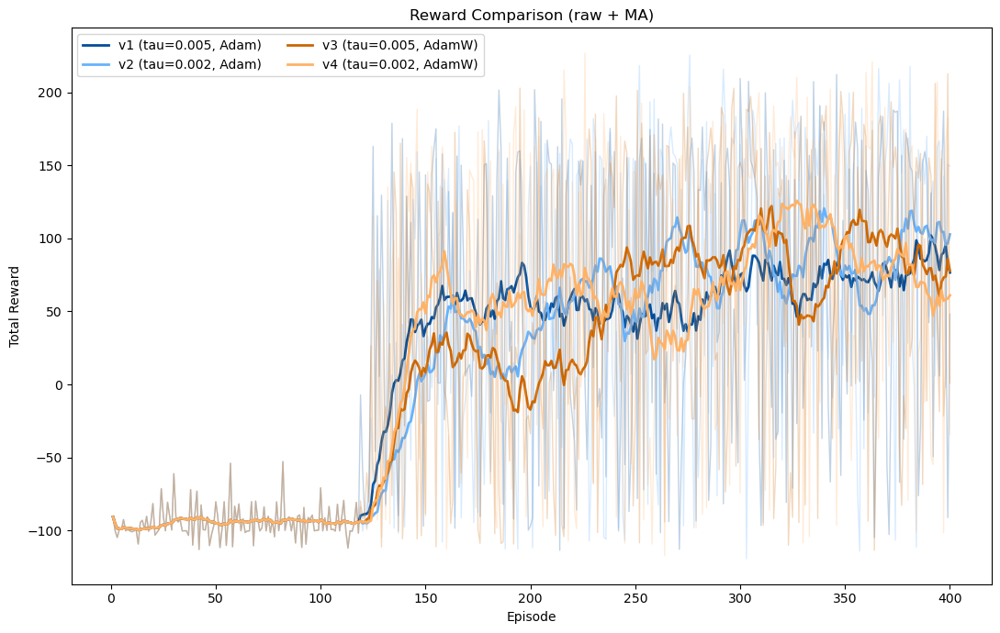

## 數據分析與討論

以下為四個版本（v1–v4）的訓練結果比較。  
橫軸為訓練回合（Episode），縱軸分別為蒼蠅的生存步數、總獎勵與吃到的食物數。
數據結果圖中：透明且波動大的為原始數據，實體線代表移動平均（moving average）
（此專案的移動窗格為20）

最初版本我們觀察到rewards的數據波動十分劇烈，因此我們的目標是減低數據波動的程度以及提高rewards
因此我們想藉由調整**兩個關鍵超參數：τ（tau）與優化器 (Adam / AdamW)**。

### 為何調整 τ（target network 更新率）
在 SAC 與 DQN 結構中，目標網路 (target network) 的更新速度由 τ 控制。  
- τ 越大 → 權重更新越快，反應最新資料，但可能造成訓練不穩定。  
- τ 越小 → 權重更新較慢，能提升穩定性，但收斂速度可能變慢。  

因此我們設定 **τ=0.005 與 τ=0.002** 兩種情境，  
觀察它在 reward 收斂速度與穩定度上的影響。

### 為何比較 Adam 與 AdamW
Adam 是常見的自適應學習率優化器，但容易因權重累積導致過擬合或不穩定。  
AdamW 則引入 **權重衰減 (weight decay)**，在理論上能改善長期穩定性並防止權重爆炸。  

為了驗證這點，我們將 Adam 與 AdamW 分別與兩種 τ 組合，形成四個版本：

| 版本 | Optimizer | τ 值 | 說明 |
|------|------------|------|------|
| v1 | Adam | 0.005 | baseline |
| v2 | Adam | 0.002 | 降低更新速率 |
| v3 | AdamW | 0.005 | 加入權重衰減 |
| v4 | AdamW | 0.002 | 同時降低更新速率與使用 AdamW |

---
接下來的分析將以 **Steps** 和 **Reward** 作為主要評估指標，  
探討這些超參數設定對學習表現與穩定度的影響。

## 數據分析結果：

### 最後 100 回合統計
| 版本 | Optimizer | τ | 平均獎勵 | 平均步數 | 平均食物數 | Reward Std | Steps Std |
|------|------------|----|-----------|------------|--------------|-------------|-------------|
| v1 | Adam | 0.005 | 75.45 | 214.08 | 14.72 | 91.87 | 76.95 |
| v2 | Adam | 0.002 | 88.26 | 237.97 | 15.55 | 89.27 | 74.45 |
| v3 | AdamW | 0.005 | 85.52 | 235.59 | 14.76 | 95.72 | 91.47 |
| v4 | AdamW | 0.002 | **91.10** | **247.02** | 15.52 | **91.64** | 83.39 |

### 全回合平均
| 版本 | 平均 Reward | 平均 Steps | 平均 Foods |
|------|--------------|-------------|-------------|
| v1 | 14.19 | 151.58 | 10.41 |
| v2 | 15.63 | 157.24 | 10.62 |
| v3 | 11.27 | 160.93 | 10.17 |
| v4 | **18.09** | 159.84 | 10.50 |

## 統計結果：

Steps | ANOVA (K=100, window=20)
F = 57.280, p = 0.000000

**Pairwise t-tests：**

| 比較組合 | t 值 | p 值 | 結果 |
|-----------|------|------|------|
| v1 vs v2 | -10.02 | 0.000000 | ★ 顯著差異 |
| v1 vs v3 | -6.96 | 0.000000 | ★ 顯著差異 |
| v1 vs v4 | -15.12 | 0.000000 | ★ 顯著差異 |
| v2 vs v3 | 1.73 | 0.084954 | 無顯著差異 |
| v2 vs v4 | -3.53 | 0.000524 | ★ 顯著差異 |
| v3 vs v4 | -4.97 | 0.000002 | ★ 顯著差異 |

- 從箱型圖可見，**v4** 的中位數最高（約 245–250 步），代表在多數情況下蒼蠅能存活最久。  
- **v2 (τ=0.002, Adam)** 次高，說明降低 τ 可讓模型訓練更平滑並延長生存。  
- **AdamW** 的版本（v3、v4）在極值範圍略大，代表雖有高峰，但波動仍偏高。
- 從箱型圖的分佈來看，當 τ 從 0.005 降至 0.002 時，各版本的箱體上下界（最高與最低值）之間的距離明顯縮小，顯示模型輸出的波動範圍變小。
- 此外，統計結果顯示 **v2 (Adam, τ=0.002)** 與 **v4 (AdamW, τ=0.002)** 之間存在顯著差異（p = 0.000524），說明即使在相同 τ 下，Optimizer 從 Adam 改為 AdamW 仍會顯著影響模型的學習表現。 
- 總體而言，Steps 的差異與 Reward 的提升趨勢一致，顯示 Reward 的改善主要來自「存活時間延長」。

---

Reward | ANOVA (K=100, window=20)
F = 15.055, p = 0.000000

Pairwise t-tests :
| 比較組合 | t 值 | p 值 | 結果 |
|-----------|------|------|------|
| v1 vs v2 | -6.13 | 0.000000 | ★ 顯著差異 |
| v1 vs v3 | -4.85 | 0.000003 | ★ 顯著差異 |
| v1 vs v4 | -7.06 | 0.000000 | ★ 顯著差異 |
| v2 vs v3 | 0.79 | 0.431 | 無顯著差異 |
| v2 vs v4 | -0.88 | 0.382 | 無顯著差異 |
| v3 vs v4 | -1.63 | 0.106 | 無顯著差異 |

- 所有版本在約第 130-150 回合後快速提升 Reward，顯示模型有成功學會生存與進食策略。
- 調整 τ 與優化器皆可顯著提升平均 Reward（v1 與其他版本差異明顯，p < 0.001）。
- 平均 Reward 提升主要來自 生存時間（Steps）延長，而非進食次數增加。
- v4 (AdamW, τ=0.002) 擁有最高平均 Reward，但波動仍然最大；v2 (Adam, τ=0.002) 則最穩定。
- 整體而言，調整 τ 與使用 AdamW 能有效提升表現，但效益有限，穩定性仍有改善空間。

## 綜合討論與分析
- 調整 τ 與 Optimizer 的確能顯著提升平均 Reward（統計上顯著）。
- 平均 Reward 提升的主因是 Steps（生存時間）延長，而非 Foods（進食次數）增加。(我們調整的主要是移動模型中的超參數)
- AdamW 的權重衰減與小 τ 的組合在短期內可達最高報酬，但仍伴隨較大波動。

## 未來可調整方向
1. 多種隨機種子（multi-seed）
例如跑 5–10 個 seeds，可過濾單次訓練的運氣因素，評估是否可複現 v4 的優勢。
2. 延長訓練（更多 episodes）
將 400 延長至 800/1000，觀察是否出現長期分化或最終穩態差異。
3. 敏感度分析
檢查 MA window（10/20/30）對結論是否穩健；若不同 window 結論一致，可信度更高。
4. 優化進食策略模型
調整DQN的超參數或是增加不同進食機制，以更貼近真實生物間的互動。
